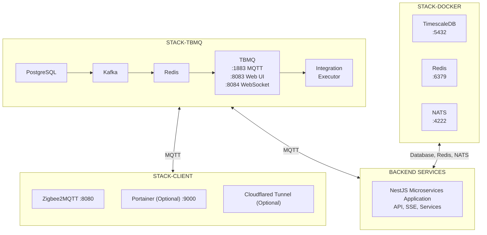

<br />
<p align="center">
  
</p>
<p align="center">
  <a href="http://nestjs.com/" target="blank"></a>
</p>

# Domotic AI

Domotic AI is a comprehensive home automation system designed to manage multiple houses with seamless integration for Zigbee2MQTT. It leverages a powerful stack to provide real-time monitoring, control, and automation of your smart home devices.

## 🚀 Features

- **Multi-House Support**: Manage multiple distinct locations from a single instance.
- **Zigbee2MQTT Integration**: Native support for Zigbee devices via MQTT.
- **Real-time Updates**: Built on an event-driven architecture using NATS and SSE.
- **Scalable Infrastructure**: Containerized with Docker for easy deployment and scaling.

## 🛠️ Tech Stack

- **Framework**: [NestJS](https://nestjs.com/) (Node.js)
- **Database**: [TimescaleDB](https://www.timescale.com/) (PostgreSQL extension for time-series data)
- **Messaging**: [NATS](https://nats.io/)
- **Caching**: [Redis](https://redis.io/)
- **Containerization**: [Docker](https://www.docker.com/) & Docker Compose

## 🖥️ Frontend Web Dashboard (web/ folder)

The project includes a modern, responsive web dashboard built with cutting-edge technologies.

| Technology          | Description                  |
| ------------------- | ---------------------------- |
| **React 19**        | Latest React with TypeScript |
| **Tailwind CSS v4** | CSS-first styling engine     |
| **Zustand**         | Lightweight state management |

### Key Features

- 🔐 **OAuth Authentication** - Google, GitHub, Microsoft support
- 🎨 **Dark/Light Theme** - Auto-detection with persistence
- 📱 **Responsive Design** - Desktop sidebar & mobile drawer
- 💎 **Glassmorphism UI** - Modern aesthetic with gradients
- 🤖 **AI Assistant** - Built-in chatbox with voice input

### Screenshots

<p align="center">
  
</p>

📖 **[View full Frontend documentation and screenshots →](web/README.md)**

## 📋 Prerequisites

Ensure you have the following installed on your system:

- [Docker](https://docs.docker.com/get-docker/)
- [Docker Compose](https://docs.docker.com/compose/install/)

## ⚙️ Configuration

1. **Clone the repository**:

   ```bash
   git clone <repository-url>
   cd domotic-ai
   ```

2. **Environment Setup**:
   Copy the example environment file to create your local configuration.
   ```bash
   cp .env.example .env
   cp .env.example .env.local
   ```
   ### READ INSTRUCTIONS IN .env.example FILE
   Open `.env` and `.env.local` and adjust the variables according to your environment (database credentials, NATS URL, etc.).

## 📦 Deployment

The complete Domotic AI system consists of multiple stacks that need to be deployed in a specific order. This section provides the complete deployment sequence.

### Deployment Overview

The system is organized into separate stacks:

1. **stack-docker** - Core infrastructure (TimescaleDB, Redis, NATS)
2. **stack-tbmq** - MQTT Broker for IoT communication
3. **stack-client** - Client-side services (Zigbee2MQTT, Portainer, Cloudflare Tunnel)
4. **Backend Services** - Main NestJS application

### Prerequisites

- [Docker](https://docs.docker.com/get-docker/) installed
- [Docker Compose](https://docs.docker.com/compose/install/) installed
- Properly configured `.env.local` file (see Configuration section above)

---

## 🏗️ Step-by-Step Deployment

### Step 1: Deploy Core Infrastructure (stack-docker)

The infrastructure stack provides the foundational services that all other components depend on.

**Services included:**

- **TimescaleDB** - PostgreSQL with TimescaleDB extension for time-series data
- **Redis** - Caching and session management
- **NATS** - Message broker for event-driven architecture

**Deploy:**

```bash
cd stack-docker
```

> ⚠️ **Important**: Review and update `docker-compose.yml` before deploying:
>
> - Change Redis password (`requirepass`)
> - Update PostgreSQL credentials
> - Configure NATS authentication in `nats.conf`

```bash
docker compose up -d
```

**Verify:**

```bash
docker compose ps
docker compose logs -f
```

Wait until all services are healthy before proceeding.

---

### Step 2: Deploy MQTT Broker (stack-tbmq)

ThingsBoard MQTT Broker handles all MQTT communication between IoT devices and the application.

**Services included:**

- **PostgreSQL** - TBMQ configuration database
- **Apache Kafka** - Message queue
- **Redis** - Caching
- **TBMQ** - MQTT Broker with web interface
- **Integration Executor** - Advanced integration features

**Deploy:**

```bash
cd ../stack-tbmq
```

> ⚠️ **Important**: Review and update `docker-compose.yml` before deploying:
>
> - Change PostgreSQL password
> - Update MQTT authentication settings
> - Configure integration options

See the [stack-tbmq/README.md](stack-tbmq/README.md) for detailed configuration instructions.

```bash
docker compose up -d
```

**Verify:**

```bash
docker compose ps
docker compose logs -f tbmq
```

Wait for the message: `ThingsBoard MQTT Broker started successfully.`

**Access the web interface:**

- URL: http://localhost:8083
- Default credentials: `sysadmin@thingsboard.org` / `sysadmin`

> 🔒 **Security**: Change default credentials immediately!

---

### Step 3: Deploy Client Services (stack-client) - Optional

Client-side services for managing IoT devices at each location. This is optional but recommended for Zigbee device management.

**Services included:**

- **Zigbee2MQTT** - Zigbee to MQTT bridge
- **Portainer** (optional) - Docker management UI
- **Cloudflare Tunnel** (optional) - Remote access

**Deploy:**

See the detailed [stack-client/README.md](stack-client/README.md) for complete step-by-step instructions.

**Quick start for Zigbee2MQTT:**

```bash
cd ../stack-client/zigbee
```

1. Update device path in `docker-compose.yml` to match your Zigbee dongle
2. Configure MQTT connection in `zigbee2mqtt-data/configuration.yaml`
3. Deploy:

```bash
docker compose up -d
```

**Access Zigbee2MQTT:**

- URL: http://localhost:8080

---

### Step 4: Deploy Backend Application

The main NestJS application that orchestrates the entire system.

**Option A: Batched Deployment (Recommended)**

We provide a `deploy-batched.sh` script that handles:

- Database migrations via Prisma
- Service startup in the correct order
- Docker image cleanup

From the project root:

```bash
./deploy-batched.sh
```

**Option B: Manual Deployment**

If you prefer manual control:

1. **Run database migrations:**

   ```bash
   npx prisma migrate deploy
   ```

2. **Start backend services:**

   ```bash
   docker compose up -d
   ```

**Verify:**

```bash
docker compose ps
docker compose logs -f
```

---

## 🔍 Post-Deployment Verification

After completing all deployment steps, verify the system is working:

### Check All Services

```bash
# Check stack-docker
cd stack-docker && docker compose ps

# Check stack-tbmq
cd ../stack-tbmq && docker compose ps

# Check backend
cd .. && docker compose ps
```

### Test Connectivity

1. **Access TBMQ Web UI**: http://localhost:8083
2. **Access Zigbee2MQTT** (if deployed): http://localhost:8080
3. **Access Portainer** (if deployed): http://localhost:9000
4. **Test Backend API**: http://localhost:3000 (or configured port)

### Monitor Logs

```bash
# View all backend logs
docker compose logs -f

# View specific service
docker compose logs -f <service_name>
```

---

## 📊 Deployment Architecture



## 🔍 Monitoring

After deployment, you can check the status of your services:

```bash
docker compose ps
```

To view logs for a specific service:

```bash
docker compose logs -f <service_name>
```

## 🛡️ Security Best Practices

1. **Change ports for expose in docker-compose.yml files**: ⚠️ Do not expose unnecessary ports to the host machine in production
2. **Change Default Passwords**: Update all default credentials
3. **Use TLS/SSL**: Configure SSL for production deployments
4. **Firewall Rules**: Restrict access to necessary ports only
5. **Regular Updates**: Keep all images up to date
6. **Monitor Logs**: Regularly check logs for suspicious activity

## 🤝 Contribution

Contributions are welcome! Please feel free to submit a Pull Request.

## 📄 License

This project is [GNU AGPL v3 licensed](LICENSE).
